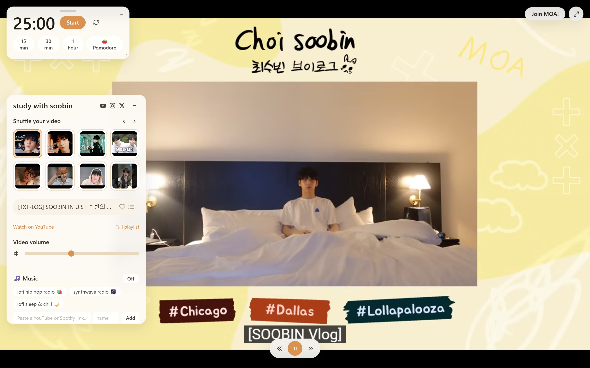

# study with soobin 🐰

A LifeAt-style Pomodoro study app. Instead of generic cafe/nature scenery, the
background is TXT Soobin's vlogs and VLIVEs — company for a study session, the
same way the [original "Study w/ Soobin" playlist](https://www.youtube.com/playlist?list=PLwzQP2wCE5w4hRj01BS0zxO2Bu8eaBDWt)
gets used.



## ⚡ Just want the app?

Download **[`StudyWithSoobin.exe`](StudyWithSoobin.exe)** from the repo root
and double-click it — no install, no setup. It opens in its own window; your
favorites and theme are remembered between launches. (Windows only; it needs
an internet connection since the videos stream from YouTube.)

## Features

- Start screen to pick your study-companion video (or hit 🎲 Surprise me) —
  "Change video" in the top right takes you back to it any time
- Looping YouTube video that always stays fully in frame (autoplay, muted
  until you turn up the volume slider)
- The timer and the control panel are separate floating cards — drag them
  anywhere, resize them from the corner, or minimize either one down to a
  small pill docked at the bottom of the screen (the timer pill keeps
  showing the countdown)
- Floating video controls: pause/play, skip back/forward 10 seconds, and a
  scrub bar — click or drag anywhere on the line to jump to that point, with
  the elapsed and total time either side of it; the music player has its own
  play/pause/seek/volume controls too
- The video controls fade away after a few seconds and come back the moment
  you move the mouse — they stay put while the video is paused or while you're
  using them. Drag them anywhere by the grip on their left
- 💬 Subtitles: the `CC` button lists whatever translations a video carries
  (most have English, Japanese, Chinese and more). Your language is remembered
  and turned back on automatically for every video that has it
- Focus timer: 15 min / 30 min / 1 hour presets, or click the time and type
  any duration ("45", "25:30", "1:30:00")
- 🍅 Pomodoro mode: set your focus length, break length, and number of
  rounds — the timer cycles through them automatically
- 🎵 Music player: built-in lofi stations with their own play/pause, seek and
  volume, or paste any YouTube or Spotify link to add your own. YouTube
  playlists work too — they get next/previous track buttons and show which
  track is playing. (Spotify embeds play 30-second previews unless you're
  signed into Spotify in the same browser.)
- 🌦️ Ambience: procedurally generated rain, snow, or storm (with thunder) —
  no audio files, works offline
- Paged thumbnail grid to switch videos mid-session
- Favorites (❤) and four themes — light, ☕ coffee, dark, and 🎨 a custom
  colour you pick yourself — all remembered between visits
- Auto-advances to a random video when the current one ends; videos that
  refuse to play embedded are skipped automatically
- No backend, no API key, no login — everything runs client-side

### 🎨 Custom colour

Pick any colour and the whole app re-skins to match. You choose one colour;
the app derives the entire palette from it — panel backgrounds, accents,
borders, and text — by taking your colour's hue and saturation and walking
them down the same lightness ladder the built-in themes use. Text contrast is
fixed by that ladder rather than by your pick, so no colour can make the app
unreadable. Pick a grey and you get a clean neutral theme; pick something
vivid and you get a bold one.

## Getting started

Requires [Node.js](https://nodejs.org/) 20+.

```
npm install
npm run dev
```

Open the printed local URL (defaults to http://localhost:5173).

Other commands:

```
npm run build      # type-check + production build to dist/
npm run preview    # serve the production build locally
npm run lint       # eslint
```

## Refreshing the playlist

The video list lives in `src/data/playlist.json`, a static snapshot (id,
title, duration, thumbnail) of the YouTube playlist. It's not fetched live —
this keeps the app free of API keys and rate limits. When new videos are
added to the source playlist, regenerate it with:

```
npm run fetch-playlist
```

This uses [`youtubei.js`](https://github.com/LuanRT/YouTube.js) to read the
playlist server-side (Node-only), so no Google API credentials are needed. To
point it at a different playlist, edit `PLAYLIST_ID` in
`scripts/fetch-playlist.mjs`.

## Desktop app

Study w/ Soobin can also run as a **native desktop application** — its own
window, no browser tab. `desktop.py` serves the built app on a local port and
opens it in an OS window via [pywebview](https://pywebview.flowrl.com/)
(WebView2 on Windows, WebKit on macOS).

```bash
# one-time setup (requires Python 3.10+)
npm install && npm run build
pip install -r requirements-desktop.txt

# launch the native window
python desktop.py
```

**To rebuild `StudyWithSoobin.exe` (Windows):** run `build-exe.bat` from the
repo root. It builds the frontend, installs the desktop deps + PyInstaller,
and packages everything into **`StudyWithSoobin.exe`** at the repo root — one
double-clickable file, no console window, nothing else to install. Your
favorites/theme persist in `%LOCALAPPDATA%\StudyWithSoobin\`.

> Note: the exe still needs an internet connection — the videos stream from
> YouTube; only the app shell is bundled.

## Project structure

```
studywithsoobin/
├── StudyWithSoobin.exe       # ⭐ ready-to-run Windows app (rebuild: build-exe.bat)
├── desktop.py                # native-window launcher (pywebview + local server)
├── build-exe.bat             # one-command exe rebuild (PyInstaller)
├── requirements-desktop.txt  # Python deps for desktop.py (pip)
├── requirements.txt          # product requirements spec (plain language)
├── docs/screenshots/         # images used by this README
├── scripts/
│   └── fetch-playlist.mjs    # refresh src/data/playlist.json from YouTube
├── src/
│   ├── App.tsx               # top-level state: current video, volume, favorites
│   ├── components/
│   │   ├── WelcomeScreen.tsx     # start screen: pick a video (or 🎲 random)
│   │   ├── VideoBackground.tsx   # letterboxed YouTube IFrame player
│   │   ├── VideoControls.tsx     # floating pill: play/pause, ±10s, scrub bar
│   │   ├── Scrubber.tsx          # shared seek bar + LIVE badge
│   │   ├── Sidebar.tsx           # floating control panel (drag/resize/minimize)
│   │   ├── TimerCard.tsx         # floating timer card (drag/resize)
│   │   ├── TimerPanel.tsx        # presets, custom time, 🍅 pomodoro cycles
│   │   ├── VideoPicker.tsx       # paged 4x2 thumbnail grid
│   │   ├── MusicPanel.tsx        # lofi stations + custom YouTube/Spotify links
│   │   ├── YouTubeMusicPlayer.tsx # mini player for YouTube music stations
│   │   ├── AmbiencePanel.tsx     # rain / snow / storm sound controls
│   │   ├── VolumeControl.tsx     # video volume slider
│   │   └── ResizeGrip.tsx        # shared corner grip for resizable panels
│   ├── hooks/
│   │   ├── useTimer.ts           # countdown + pomodoro state machine
│   │   ├── usePanelSize.ts       # width/height state for floating panels
│   │   └── useYouTubeIframeApi.ts # one-time YT API script loader
│   ├── lib/
│   │   ├── musicLink.ts          # YouTube/Spotify URL → playable station
│   │   ├── theme.ts              # one picked colour → the whole palette
│   │   └── ambience.ts           # Web Audio rain/snow/storm engine
│   ├── data/playlist.json    # checked-in snapshot of the playlist
│   └── types/                # playlist types + minimal YT ambient types
├── index.html                # Vite entry point
└── *.config.js / tsconfig.json  # Vite / Tailwind / ESLint / TypeScript config
```

## Tech stack

- React + TypeScript + Vite
- Tailwind CSS
- YouTube IFrame Player API (background playback)
- `youtubei.js` (dev-only, for the playlist-refresh script)

## Notes

- Video/channel branding (thumbnails, titles, watermarks) belongs to the
  original creators; this project only embeds and links to their public
  YouTube content. The screenshots above are of the app in use and show
  frames from those videos.
- The bundled `src/data/playlist.json` was last refreshed 2026-07-12.
